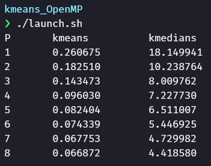

<h1 align="center">Kmeans - Parallel Programming with OpenMP</h1> 

This repository contains the parallelization of two variants of the **kmeans** algorithm (the standard and the k-medians version) using **Open-MP**.

All the details and design choices are explained in the [final report](https://github.com/ParsaD23/kmeans_OpenMP/blob/master/Kmeans%20-%20Parallel%20Programming%20with%20OpenMP.pdf).

## Run the algorithm

Run the `launch.sh` script to launch the kmeans algorithm and print the elapsed times (in seconds) per number of threads used. Your output will be similar to this:

where `P` indicates the number of processors.

## License

This project is under the MIT license. See [LICENSE](https://github.com/ParsaD23/Kmeans_OpenMP/blob/master/LICENSE) for more information.
 
